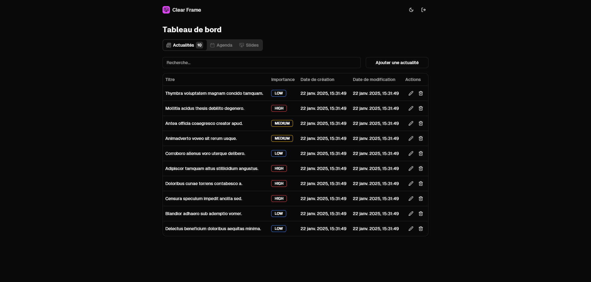

# Clear Frame



## Introduction

Clear Frame est une application conçue pour transformer votre écran en un affichage informatif et visuellement attrayant. 
Vous pourrez y afficher vos dernières actualités, la météo de votre ville et un agenda avec les dernières évènements à venir, rendant votre écran en veille à la fois fonctionnel et esthétique. 
Il y a aussi un système de diaporama dans lequel vous allez pouvoir ajouter vos propres images pour les afficher sur votre écran.

## Installation

1. Installer les dépendances JavaScript
```sh
npm install
```

2. Copier le fichier d'environnement
```sh
cp .env.example .env
```

3. Générer une nouvelle `APP_KEY`
```sh
node ace generate:key
```

4. Ajoutez votre clé API OpenWeatherMap et la ville (optionnel) dans le fichier `.env`:

```sh
OPENWEATHER_API_KEY=YOUR_API_KEY
OPENWEATHER_CITY=YOUR_CITY
```

5. Ajouter le délai entre chaque slide de la diaporama dans le fichier `.env`:

```sh
CAROUSEL_DELAY=5000
```

5. Migrer la base de données
```sh
node ace migration:fresh
```

1. Lancer le serveur
```sh
npm run dev
```

## Technologies

- [AdonisJS](https://adonisjs.com/)
- [Tailwind CSS](https://tailwindcss.com/)
- [shadcn/ui](https://ui.shadcn.com/)
- [React](https://react.dev/)
- [Inertia.js](https://inertiajs.com/)

## Commandes disponibles

```sh
node ace account:create                 # Pour créer un compte
node ace account:delete <username>      # Pour supprimer un compte
node ace account:list                   # Pour lister les comptes
node ace account:passwd <username>      # Pour changer le mot de passe d'un compte
```